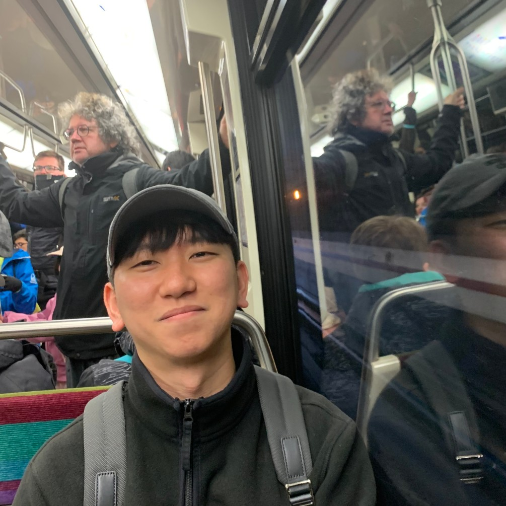

## About Me

Hi! I am Dongjae Lee. I am an assistant professor at Kangwon National University.

---

## Research Interest

Symmetric Cryptology and Quantum Cryptanalysis

---

## Publications

### - 2024

ARADI 암호의 바이트 동일 특성 (Byte-wise equal property of the ARADI cipher)  
*한국정보보호학회 동계학술대회 (CISC-W'24)*  
김선엽, 김선규, 신명수, 김인성, 신한범, 권동근, 석병진, **이동재**, 홍득조, 성재철, 홍석희  

부분합 기법과 FFT 기법을 활용한 6-라운드 AES에 대한 새로운 Square 공격 (New Square Attack with Partial Sums and FFT Technique on 6-round AES)  
*한국정보보호학회 동계학술대회 (CISC-W'24)*  
신한범, 김선규, 신명수, 김인성, 김선엽, 권동근, 석병진, **이동재**, 홍득조, 성재철, 홍석희   

축소 라운드 LEA에 대한 새로운 선형 구별자 (New Linear Distinguisher for Reduced-Round LEA)  
*한국정보보호학회 동계학술대회 (CISC-W'24)*  
신명수, 김선규, 신한범, 김인성, 김선엽, 권동근, 석병진, **이동재**, 홍득조, 성재철, 홍석희  

AES 기반 AEAD 스킴의 키 커밋 공격 복잡도 계산 (Complexity Analysis of Key Committing Attacks on AES-based AEAD Scheme)  
*한국정보보호학회 동계학술대회 (CISC-W'24)*  
김선규, 신명수, 신한범, 김인성, 김선엽, 권동근, 석병진, **이동재**, 홍득조, 성재철, 홍석희  

 Redefining Security in Shadow Cipher for IoT Nodes: New Full-Round Practical Distinguisher and the Infeasibility of Key-Recovery Attacks   
*IEEE Internet of Things Journal, 2024*  
Sunyeop Kim, Myoungsu Shin, Seonkyu Kim, Hanbeom Shin, Insung Kim, Donggeun Kwon, **Dongjae Lee**, Seonggyeom Kim, Deukjo Hong, Jaechul Sung, and Seokhie Hong  

 Improved Quantum Rebound Attacks on Double Block Length Hashing with Round-Reduced AES-256 and ARIA-256   
*IACR Transactions on Symmetric Cryptology, 2024*  
**Dongjae Lee** and Seokhie Hong  

 Accurate False-Positive Probability of Multiset-Based Demirci-Selçuk Meet-in-the-Middle Attacks   
*IEICE Transactions on Fundamentals of Electronics, Communications and Computer Sciences, 2024*  
**Dongjae Lee**, Deukjo Hong, Jaechul Sung, and Seokhie Hong  

### 2023

PIPO에 대한 차분 및 차분 중간일치 공격 (Differential and Differential Meet-In-The-Middle Attack on PIPO)  
*한국정보보호학회 하계학술대회 (CISC-S'23)*  
김인성, 신한범, 김선엽, 권동근, 신명수, **이동재**, 김성겸, 홍득조, 성재철, 홍석희  

 A Practical Ciphertext-Only Attack on GMR-2 System   
*IEEE Access, 2023*  
**Dongjae Lee**, Jaewoo Kim, Deukjo Hong, Jaechul Sung, and Seokhie Hong  

### 2021

 Improved Ciphertext-Only Attack on GMR-1   
*IEEE Access, 2021*
**Dongjae Lee**, Deukjo Hong, Jaechul Sung, Seonggyeom Kim, and Seokhie Hong  

### 2019

실시간 사이버 위협 지능형 분석 및 예측 기술 (Real-time Cyber Threat Intelligent Analysis and Prediction Technique)  
*정보과학회 컴퓨팅의 실제 논문지, 2019*  
임창완, 신영섭, **이동재**, 조성영, 한인성, 오행록  

### 2018

실시간 사이버 위협 정보 지능형 분석 및 예측 기술 제안 (A study of real-time cyber threat intelligent analysis and prediction technique)  
*한국정보과학회 2018 한국소프트웨어종합학술대회 논문집*  
임창완, 신영섭, **이동재**, 조성영, 한인성, 오행록  

---

## Preprint

Byte-wise Equal Property of ARADI  
*Cryptology ePrint Archive, 2024*  
Sunyeop Kim, Insung Kim, **Dongjae Lee**, Deukjo Hong, Jaechul Sung, and Seokhie Hong  

---

## Awards

Year | Content 
-----|-------
2024 | 국가암호공모전 장려상
2024 | 한국정보보호학회 동계 학술대회 우수논문상(정보보호학회장상)
2024 | 한국정보보호학회 동계 학술대회 우수논문상(한국인터넷진흥원 원장상)
2023 | 국가암호공모전 우수상
2023 | 한국정보보호학회 하계 학술대회 우수논문상

## Committee
2025 ICISC Program Chair \\
정보보호학회 이사 (2025.1.1.~) \\
2024 ICISC Program Committee / Session Chair \\
2024 한국디지털포렌식학회 하계 학술대회 Session Chair